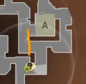
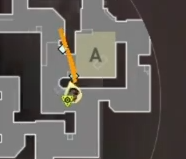
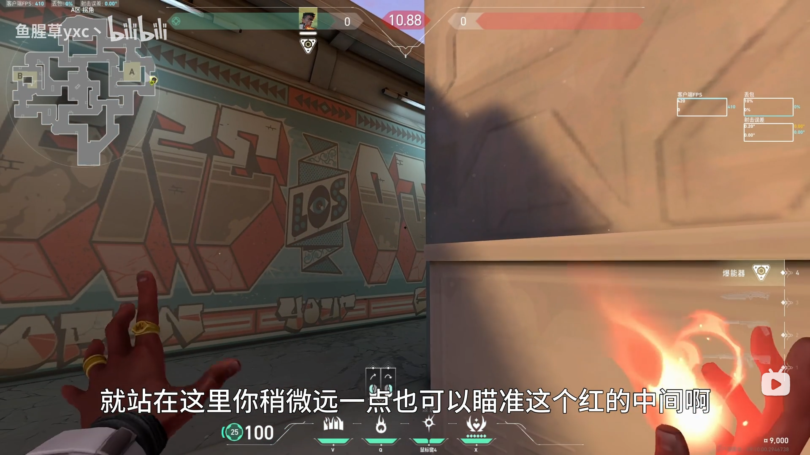
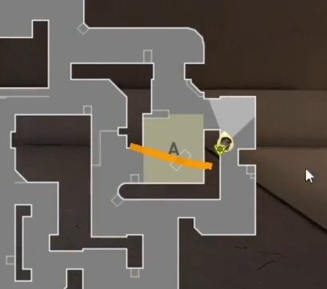
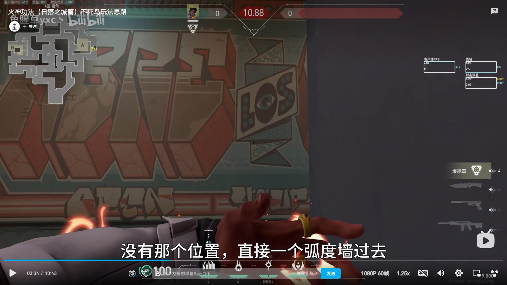
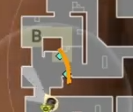
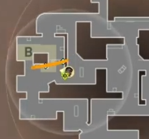

# 日落之城 火男 公式

## 1. 进攻A区

### 1.1 开局

开局不抢A大，可封墙切割抢elbow，如果队友有震，可以用震代替火墙

### 1.2 A大进攻

地图标点升火墙，清理两个老六位，然后打闪跳拉A连，随后打火墙出烟闪进包点。注意与队友沟通帮忙架A连混烟敌人。

### 1.3 A小进攻

#### A小拐角火

A小拐角火点位，跑投。

拐角火+闪清理拐角

然后叫队友清理警家，火男去包点

#### 包点隔断火

瞄点

火墙后闪清理包点后

## 2. 进攻B区

进攻公式墙

### 2.1 有道具辅助进点

打墙后闪清理包点右侧，然后可选择清市场或者包点后

### 2.2 自助进点

进点闪，直走，烧拐角火球，打闪清警家

### 2.3 单人控B

火墙，拐角火，进点闪

## 3. 回防A区

### 有两个闪

拿枪清理A连近点，然后打闪清理A大

起包点隔断火，火球烧死点，打火墙后闪干拉

## 4. 回防B区

建议单走市场

封火墙烧两个老六点位，然后打闪出